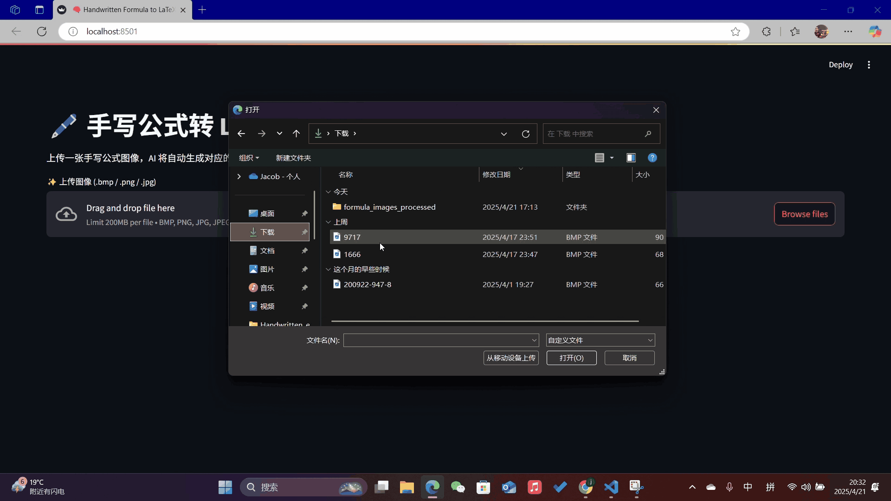

# LaTeX-OCR

Handwritten Mathematical Formula Recognition using ResNet34 + Transformer Architecture.  
This project converts images of handwritten LaTeX equations into machine-readable LaTeX code.

---

## 📹 Demo

I uploaded some images from my test dataset and wrote some equations by myself on computer to test it




---

## 📚 Project Overview

LaTeX-OCR is a deep learning pipeline for recognizing and converting images of handwritten mathematical expressions into LaTeX code. It uses:

- **Encoder**: ResNet34 backbone with 2D positional encoding and row-wise LSTM.
- **Decoder**: Transformer Decoder architecture.
- **Training**: Label smoothing loss, warm-up and cosine annealing scheduler.
- **Inference**: Beam Search decoding for sequence generation.

---

## 🚀 Features

- Supports handwritten mathematical formulas.
- Augmented training (random rotation, color jitter).
- Beam Search decoding for higher prediction accuracy.
- Token-level accuracy, Normalized Edit Distance (NED), and BLEU score evaluation.
- Visualization tools (loss curves, feature maps, confusion matrix).

---

## 🤖Summary of The Project

This project was inspired from my daily life of using LaTeX codes. For the performence of my model, there is the existence of the overfit, if I use my test dataset to test the model, it shows really good performance, when I upload the images which wrote by me, the model shows the limited generalization ability. The accuracy is like 40%-50%. But however, I learned lots of machine learning knowledge from this project and other important ability so solve the qustions, this will help my future career life and academic life.

---

## ⚡Tips
If the codes are not running well, use the codes from LaTex_Equation_Generator.ipynb to run and test the code.

---

## 🛠 Installation

Clone the repository:

```bash
git clone https://github.com/GuoJiashu/LaTex_Equation_Generator
cd LaTeX_OCR
```
Or

Run the .ipynb file

---

## 🗂️Model Structure

| Layer (type:depth-idx)                | Input Shape         | Output Shape         | Param #    |
|:--------------------------------------|:--------------------|:---------------------|:-----------|
| **Im2LatexModel**                     | [32, 3, 128, 512]    | [32, 223, 136]        | --         |
| ├─ Encoder: 1-1                       | [32, 3, 128, 512]    | [32, 16, 64, 384]     | --         |
| │   ├─ Sequential: 2-1                | [32, 3, 128, 512]    | [32, 128, 16, 64]     | --         |
| │   │   ├─ Conv2d: 3-1                | [32, 3, 128, 512]    | [32, 64, 64, 256]     | 9,408      |
| │   │   ├─ BatchNorm2d: 3-2           | [32, 64, 64, 256]    | [32, 64, 64, 256]     | 128        |
| │   │   ├─ ReLU: 3-3                  | [32, 64, 64, 256]    | [32, 64, 64, 256]     | --         |
| │   │   ├─ MaxPool2d: 3-4             | [32, 64, 64, 256]    | [32, 64, 32, 128]     | --         |
| │   │   ├─ Sequential: 3-5            | [32, 64, 32, 128]    | [32, 64, 32, 128]     | 221,952    |
| │   │   └─ Sequential: 3-6            | [32, 64, 32, 128]    | [32, 128, 16, 64]     | 1,116,416  |
| │   ├─ Conv2d: 2-2                    | [32, 128, 16, 64]    | [32, 384, 16, 64]     | 49,536     |
| │   ├─ PositionalEncoding2D: 2-3      | [32, 384, 16, 64]    | [32, 384, 16, 64]     | --         |
| │   └─ LSTM: 2-4                      | [512, 64, 384]       | [512, 64, 384]        | 887,808    |
| ├─ Decoder: 1-2                       | [32, 223]            | [32, 223, 136]        | 172,032    |
| │   ├─ Embedding: 2-5                 | [32, 223]            | [32, 223, 384]        | 52,224     |
| │   ├─ TransformerDecoder: 2-6        | --                   | [32, 223, 384]        | --         |
| │   │   └─ ModuleList: 3-7             | --                   | --                    | 18,932,736 |
| │   └─ Linear: 2-7                    | [32, 223, 384]       | [32, 223, 136]        | 52,360     |

---

**Model Summary:**

- **Total parameters:** 21,494,600
- **Trainable parameters:** 21,494,600
- **Non-trainable parameters:** 0
- **Total Multiply-Adds (Giga):** 101.45
- **Estimated Model Size (MB):** 3653.03

| Resource Type      | Size (MB)  |
|:-------------------|:-----------|
| Input Size          | 25.42      |
| Forward/Backward Size | 3580.16   |
| Parameters Size    | 47.44      |
| **Total Estimated** | **3653.03** |

